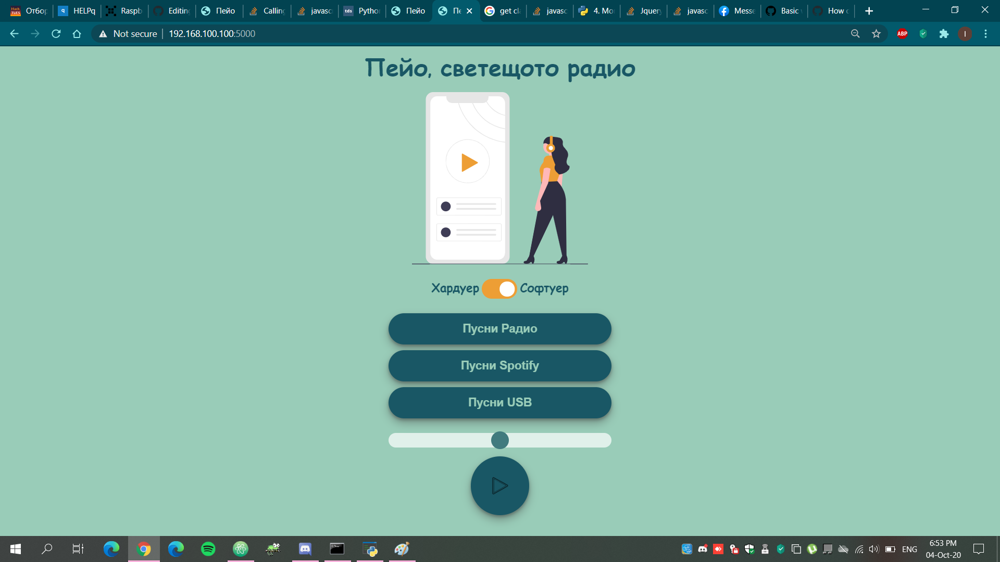
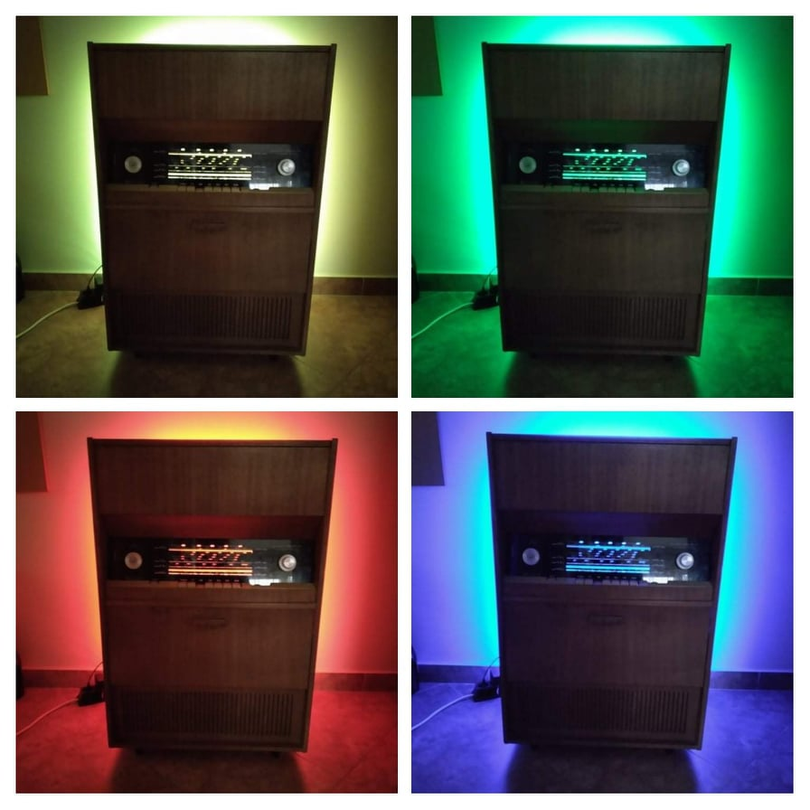

# Peyo
A student project for HackTUES 6
We renovated an old radio so that it can play music again!
We also added distant-control ability for people on the same network as the new heart of the radio - the Raspberry Pi.

### You can watch a demo of the project [here.](https://youtu.be/siEtyv2V2Zg)

## Used hardware:
- Radio "Akord 104"
- Arduino Uno
- Raspberry Pi
- RGB led strip
- Amplifier

## Used software:
- Python flask
- HTML&CSS
- C code(for microcontrollers)
- OrCAD Capture(for schematic)

## Webpage/Hardware functionalities:
- Play Radio
- Play Spotify
- Play from USB
- Mute
- Control Volume

