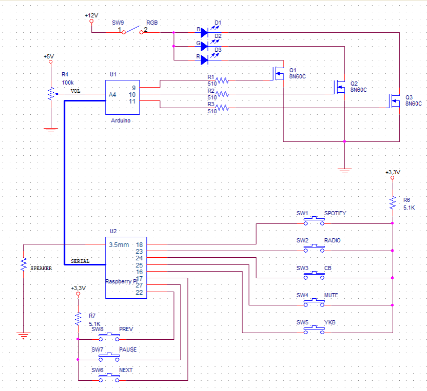

# Peyo :radio:
A student project for HackTUES 6.  
We renovated an old radio so that it can play music again!  
We also added remote-control ability for people on the same network as the new heart of the radio - the Raspberry Pi.  

#### You can watch a demo of the project [here.](https://youtu.be/siEtyv2V2Zg)  
#### The presentation for the project can be found [here.](https://docs.google.com/presentation/d/121YX6xRevagpxVobXodJiMqY01eyq3IZO1ueWaVWT64/edit?usp=sharing)  

## Used hardware:
:electric_plug: Radio "Akord 104"  
:electric_plug: Arduino Uno  
:electric_plug: Raspberry Pi  
:electric_plug: RGB led strip  
:electric_plug: Amplifier  

## Used software:
:radio_button: Python Flask  
:radio_button: HTML & CSS  
:radio_button: C code (for microcontrollers)  
:radio_button: OrCAD Capture(for schematic)  

## Functionalities:
:sound: Play Radio  
:sound: Play Spotify  
:sound: Play from USB  
:sound: Control Volume  
:sound: Mute  
:sound: Google Assistant

## Team
:star: [Iliana Genova](https://github.com/IlianaGenova)  
:star: [Boryana Stefanova](https://github.com/Boryana23)  
:star: [Venelin Atanasov](https://github.com/venelinatanasov)  
:star: [Stefan Antonov](https://github.com/StefanAntonov)  
:star: [Ivaelo Krustev](https://github.com/Ivaelo)  

